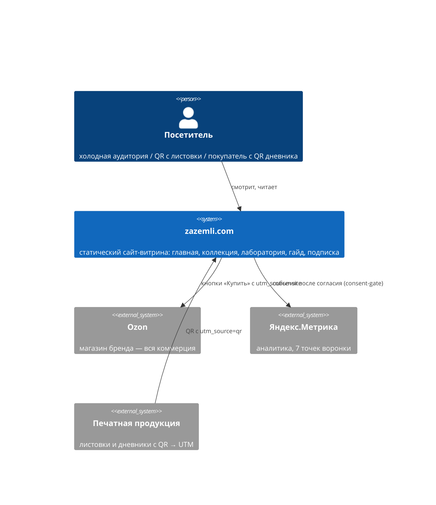

# Архитектура

> Глобальные, долгоживущие архитектурные решения. Per-change design живёт в `openspec/changes/<name>/design.md`.

> **Пример заполнения:** `example_docs/ARCHITECTURE.md` (включая C4-диаграммы в Mermaid)

## 1. Обзор системы
Полностью статический маркетинговый сайт: Next.js собирает 5 страниц в статику (`output: 'export'`), которая раздаётся любым статик-хостингом. Бэкенда, БД и CMS на MVP нет — контент живёт TS-константами в репозитории. Внешние взаимодействия: исходящие ссылки на Ozon (вся коммерция там), Яндекс.Метрика (после согласия), входящий QR-трафик с печатной продукции (UTM-разметка). Каркас рассчитан на рост: каталог `/collectio/[plant]`, Sanity и магазин добавляются позже без перестройки.

## 2. C4 Level 1 — System Context

## 3. Компоненты
| Компонент | Ответственность |
|-----------|-----------------|
| `app/` (роуты + layout) | 5 страниц, метаданные/SEO, `not-found`, подключение шрифтов и обвязки |
| `components/sections/<page>/` | Секции страниц (главная: Hero, WhatsInBox, DifferentSoil, WhatSoilGives, SkuGallery, Statement, About, Teasers, OzonCta) |
| `components/site/` | SiteHeader, SiteFooter, CookieBanner (consent-gate), Metrika |
| `components/ui/` | shadcn-примитивы + бренд-атомы DS (Fleuron, CaveatNote, MaterialDot, KickerHeader…) |
| `content/` | Контент TS-константами: SKU, тексты секций, навигация, футер-реквизиты |
| `lib/` | `utm.ts` (Ozon-ссылки), `metrika.ts` (цели 7 точек) |
| `styles/globals.css` | Дизайн-токены (CSS-переменные из `tokens.json` v1.0.1) + Tailwind-тема |

## 4. Ключевые интерфейсы
- **UTM-контракт.** Исходящие на Ozon: `utm_source=site`, per-SKU `utm_content=sku00X`. Входящие с печати: `utm_source=qr&utm_medium=print&utm_campaign=partia-0` (зашито в QR, сайт ничего не делает — считает Метрика).
- **Цели Метрики (7 точек):** QR-заходы на `/collectio`, `/guide`, `/lab` (по UTM); клики `/lab`→`/collectio` и `/guide`→`/collectio`; проваливание в карточку SKU (post-MVP); клик «Купить на Ozon».
- **`ozonStoreUrl: string | null`** в `content/site.ts` — единственная точка подключения магазина; `null` → кнопки «Скоро на Ozon».
- **Форма `/diary-signup`** (post-MVP, ждёт копи): клиентский POST во внешний email-сервис; чекбокс 152-ФЗ обязателен.

## 5. Модель данных
Контентные типы в `src/content/` (TS): `Sku` (номер N°001–007, имя, латынь, sku-цвет, объёмы, ozonUrl?), `NavItem`, `FooterInfo` (реквизиты ИП, дисклеймер, контакты, QR), `HomeContent` (тексты 9 секций). Связей и хранилища нет — плоские константы. При миграции на Sanity типы становятся контрактом схем.

## 6. Ключевые архитектурные решения
| Решение | Выбор | Обоснование |
|---------|-------|-------------|
| Деплой-модель | Static export (`output: 'export'`) | Сайт полностью статичен; максимум стабильности и свободы хостинга (РФ-контекст, Vercel не рекомендован); решение пользователя 2026-06-12 |
| Контент | TS-константы в репо, без CMS | Контента мало, релиз важнее; типы готовят миграцию на Sanity; решение пользователя 2026-06-12 |
| Структура компонентов | По роли (`ui`/`site`/`sections`), не atomic-папки | Меньше церемоний; маппинг на уровни БЗ — таблицей в DEVELOPMENT.md; решение пользователя 2026-06-12 |
| Аналитика и согласие | Consent-gate: Метрика только после «Принять» в cookie-баннере | Бриф §8: по умолчанию необязательные cookie отклоняются (152-ФЗ) |
| Изображения | `images.unoptimized` + контейнеры с фикс. пропорциями | Static export без оптимизатора; иллюстрации придут позже — без CLS |
| `/diary-signup` | Вне навигации, `noindex` | Вход только по QR из печатного дневника (бриф §2); индексация не нужна |

## 7. Безопасность
Сайт не собирает персональные данные (единственная будущая форма — email на `/diary-signup`: согласие 152-ФЗ + ссылка на политику, zod-валидация). Секретов нет: `NEXT_PUBLIC_METRIKA_ID` публичен по природе. Cookie — только после согласия. Атакуемая поверхность статического сайта минимальна.

## 8. Развёртывание
`npm run build` → каталог `out/` → любой статик-хостинг (кандидаты: nginx на VPS, Cloudflare Pages, Reg.ru; выбор — отдельная задача, ТРЕК 4). Резервный домен `zazemli.space` → 301 на `zazemli.com` (настраивается на хостинге). CI/CD на MVP нет — билд и деплой локально; добавить после выбора хостинга.
